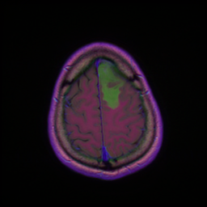
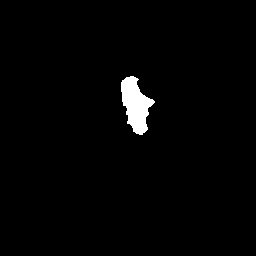
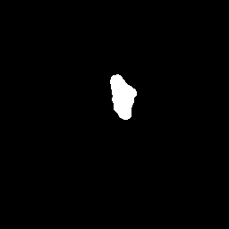

# 🧠 MRI Brain Tumor Segmentation using U-Net

## 📊 Dataset
- Dataset used: [Brain MRI segmentation](https://www.kaggle.com/datasets/mateuszbuda/lgg-mri-segmentation)

## 📌 Project Overview
This project focuses on **automatic brain tumor segmentation** from MRI scans using a **U-Net architecture**.  
The aim is to accurately identify and segment tumor regions, which is critical for medical diagnosis and treatment planning.

## 🚀 Features
- Preprocessing MRI scans for model training  
- Implementation of **U-Net** for semantic segmentation  
- Training with Dice loss and IoU as evaluation metrics  
- Visualizations of predicted segmentation masks  
- Organized code using **Jupyter Notebook**  

## 🛠️ Tech Stack
- Python  
- TensorFlow / Keras  
- NumPy & Pandas  
- Matplotlib & Seaborn  
- OpenCV  

## 📂 Project Structure
```
├── MRI_Brain_Tumor_Segmentation_UNet.ipynb   # Main Jupyter Notebook
├── data/                                     # Dataset folder
├── results/                                  # Example segmentation results
├── README.md                                 # Project Documentation
```

## ⚙️ Steps
1. **Data Loading** – Import MRI scans and ground truth masks  
2. **Preprocessing** – Normalize images, resize, and augment data  
3. **Model Architecture** – Implement **U-Net** with encoder-decoder structure  
4. **Training** – Train using Dice loss and Adam optimizer  
5. **Evaluation** – Measure performance with Dice Coefficient & IoU Score  
6. **Visualization** – Compare original MRI, ground truth mask, and predicted segmentation  

## 📊 Results
- **Dice Coefficient:** ~86%  
- **IoU Score:** ~85%  

### 🔹 Example Segmentations

| MRI Image | Ground Truth | Prediction |
|-----------|--------------|------------|
|  |  |  |

---

## 🙏 Acknowledgements
Special thanks to **Dr. [George Samuel Mahrous
]** for guidance, supervision, and valuable feedback during the project.
